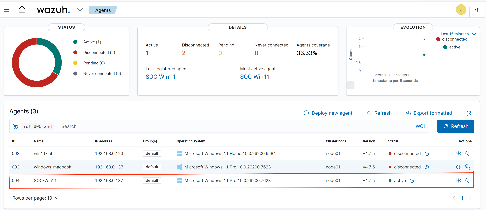
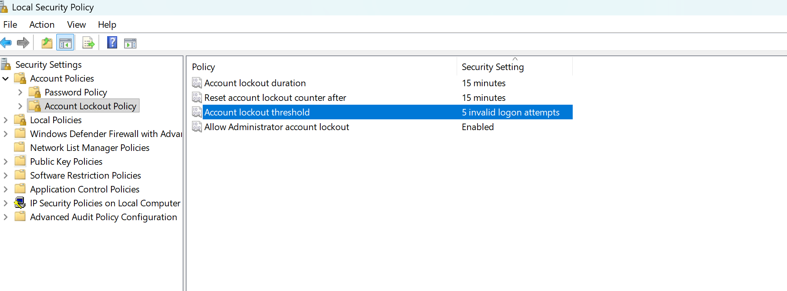
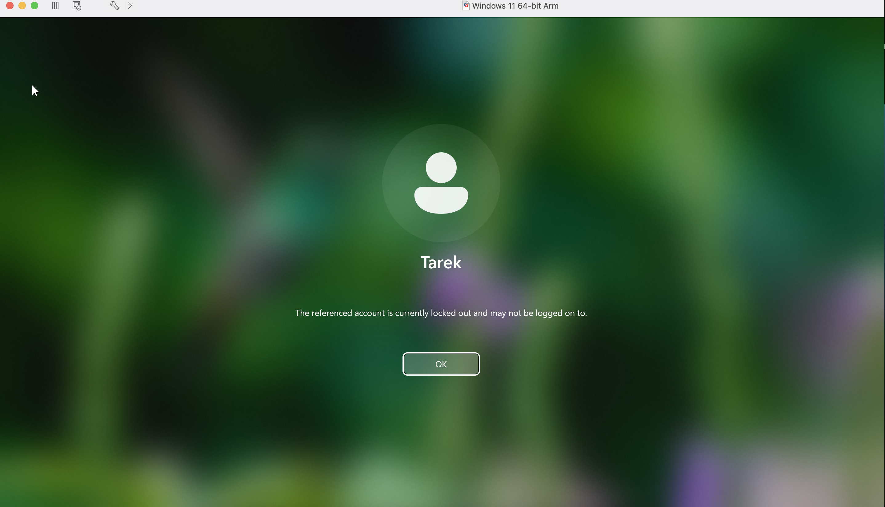
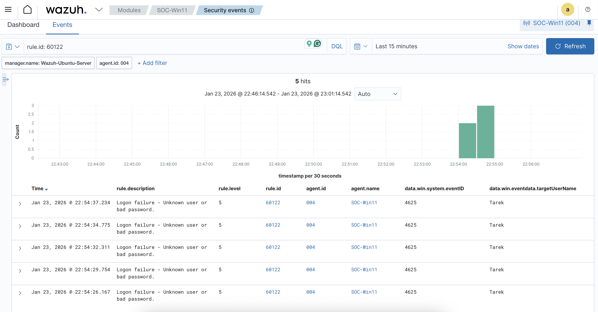
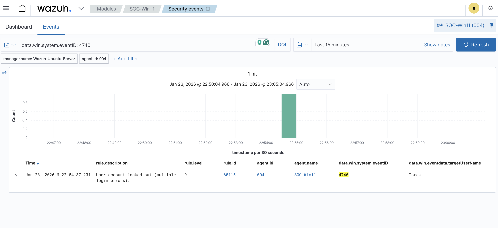
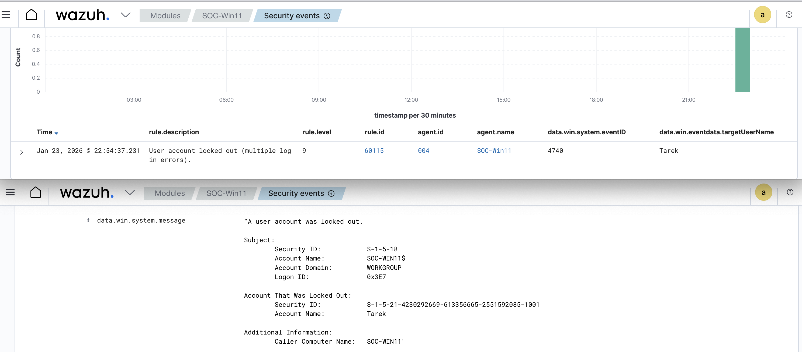
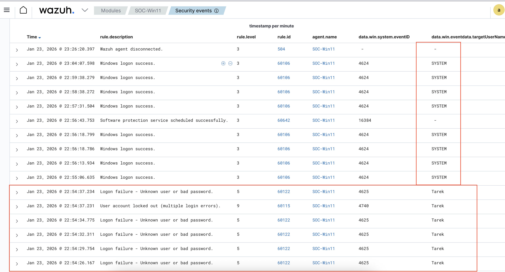

# Incident Report: Brute-Force Attempt and Account Lockout

## 1. Incident Summary
Wazuh SIEM detected multiple failed login attempts against a local Windows user account. After several authentication failures, the account was automatically locked by the system. Post-lockout monitoring confirmed that the targeted user did not successfully log in again.

## 2. Detection Source
- **SIEM:** Wazuh  
- **Log Source:** Windows Security Event Channel  
- **Agent Name:** SOC-Win11  

## 3. Timeline of Events

| Time | Event Description | Wazuh Rule ID |
|------|------------------|---------------|
| Jan 23, 2026 22:54:26 | Failed logon attempt detected | 60122 |
| Jan 23, 2026 22:54:37 | Repeated logon failures | 60122 |
| Jan 23, 2026 22:54:37 | User account locked due to failures | 60115 |
| Jan 23, 2026 22:55:06 | System logon activity (SYSTEM user) | 60106 |

---

## 4. Monitoring Context and Key Evidence

### Wazuh Dashboard Overview

- Confirms the Wazuh SIEM is operational.
- Shows the Windows agent is active and reporting events.
- Validates that alerts in this report are from a live monitored system.

### Account Lockout Policy Configuration

- Shows Windows account lockout policy is enabled.
- Confirms defensive controls were in place before the attack.

### User Account Locked

- Multiple failed login attempts locked the user **Tarek**.

### Logon Failure Events

Multiple failed login attempts were recorded for the user **Tarek**, consistent with a brute-force attempt.

### Account Lockout Event

Wazuh detected an account lockout after repeated failures, confirming that the security policy was enforced.

### Account Lockout Details

The lockout event provides additional details about the affected account and the authentication activity that triggered the defensive control.

### Post-Lockout Authentication Activity

Only the **SYSTEM** account logged in successfully. The locked user **Tarek** had no successful logons, confirming the attacker was blocked.

---

## 5. Incident Evidence and Analysis

Multiple failed login attempts were recorded for the user **Tarek**, followed by an automatic account lockout. Wazuh detected the authentication failures and the resulting lockout event.

Post-lockout monitoring showed only **SYSTEM** account activity and no successful logon for the targeted user. This indicates that the account lockout mechanism prevented the attempted brute-force attack from resulting in unauthorized access.

---

## 6. MITRE ATT&CK Mapping
- **T1110 – Brute Force**  
- **T1078 – Valid Accounts (Attempted)**  

---

## 7. Impact Assessment
The attempted brute-force attack did not result in unauthorized access. The account lockout mechanism successfully prevented further login attempts, reducing the risk of compromise.

---

## 8. Recommendations
- Maintain strict account lockout policies.
- Monitor repeated authentication failures.
- Alert on account lockout events.
- Review authentication logs regularly.

---

## 9. Conclusion
This incident demonstrates how Wazuh SIEM can detect brute-force attacks and verify that defensive controls are working correctly. Continuous monitoring and proper policy enforcement are effective in preventing unauthorized access.
